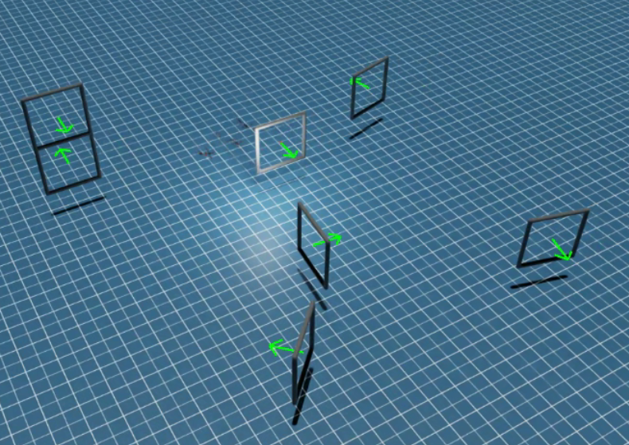

# CIS5190 Final Project: **RL-based High-Speed Drone Racing**
CIS5190-Applied-ML@UPenn, Applied Machine Learning (Fall 2024)

### Course Outline
> Machine learning has been essential to the success of many recent technologies, including autonomous vehicles, search engines, genomics, automated medical diagnosis, image recognition, and social network analysis. This course will introduce the fundamental concepts and algorithms that enable computers to learn from experience, with an emphasis on their practical application. It will introduce supervised learning (linear and logistic regression, decision trees, neural networks and deep learning, and Bayesian networks), unsupervised learning (clustering and dimensionality reduction), and reinforcement learning. --- cite from [CIS5190 Course Outline](https://www.seas.upenn.edu/~cis5190/fall2024/)


### Work Summary
Reinforcement Learning (RL)-based drone racing has emerged as a popular research topic in robotics, showcasing significant advancements in autonomous control under high-speed, dynamic conditions. The Robotics and Perception Group (RPG) at the University of Zurich(UZH) has led groundbreaking work [1,2], demonstrating the practical success of Sim2Real RL approaches in real-world.

Inspired by [Prof. Antonio Loquercio's seminar](https://www.grasp.upenn.edu/events/fall-2024-grasp-on-robotics-antonio-loquercio/) [3], we aim to reproduce a simulated drone racing track and train a policy that enables agents to fly through the track as efficiently and quickly as possible. We utilize OmniDrones [4], a new simulation platform built on NVIDIA IsaacSim and IsaacLab [5,6].

Our reward design focuses on three key objectives: minimizing the drone's distance to the target gates, promoting progression through the racetrack, and ensuring flight stability. We trained our policy using the Proximal Policy Optimization (PPO) algorithm [7,8] across 250 parallel environments, accumulating a total of 150,000,000 frames per experiment to achieve sufficient exploration and learning.

As a result, the trained policy successfully enables our agents to complete a 127-meter ellipse track in 16 seconds, achieving an average speed of $7.94 m/s$, with a success rate of $40.7\%$.


### Contributions
- `cfg/task/RacingTrack/`: A series of 3D gate tracks for drone racing. 
    - `vis/` folder of `RacingTrack` contains the visualization of the tracks.
    - `circle.yaml`: A 38-meter, 1:1 circle track.
    - `ellipse.yaml`: A 127-meter, 12:8 ellipse track.
    - `split_s.yaml`: A S-shape tunnel track.
    - `UZH_track.yaml`: A challenging track with multiple gates and sharp turns.
    - `vis_3D_map.py`: A script to visualize the track in 3D.
    - `readme.md`: information about the track.
    - All the tracks can be scaled to different sizes by changing the `map_scale` parameter in the `task.yaml` file.
    - Gate scale is set to 1.0 by default.
- `scripts/`:
    - `train.py`: A modified script to train the policy, with wandb logging.
    - `play.py`: A new script to play the policy with saved checkpoints.
    - `train.yaml`: A configuration file for the training script.
    - `play.yaml`: A configuration file for the playing script.
- `omnidrones/envs/single/`:
    - `racing.py`: Tony Wang's reward function.
    - `FlyThrough.py`: Tony Wang's visualization debug tool.
    - `track.py`: Tony Wang's trajectory tracking model. 
    - `racing_simple.py`: Jerry Wang's reward function, final usage. 



### Current development environment: 
> Notice the IsaacSim 4.2.0 has compatibility issues with multi-GPU rendering.
- IsaacSim 4.1.0, IsaacLab 1.3.0
- Python 3.10
- CUDA 12.1

## Video Recordings
- TODO: add video recordings
- TODO: add track visualization


---

# OmniDrones

[](https://docs.omniverse.nvidia.com/app_isaacsim/app_isaacsim/overview.html)
[](https://docs.python.org/3/whatsnew/3.7.html)
[](https://omnidrones.readthedocs.io/en/latest/)
[](https://opensource.org/licenses/MIT)
[](https://discord.gg/J4QvXR6tQj)

*OmniDrones* is an open-source platform designed for reinforcement learning research on multi-rotor drone systems. Built on [Nvidia Isaac Sim](https://docs.omniverse.nvidia.com/app_isaacsim/app_isaacsim/overview.html), *OmniDrones* features highly efficient and flexible simulation that can be adopted for various research purposes. We also provide a suite of benchmark tasks and algorithm baselines to provide preliminary results for subsequent works.

For usage and more details, please refer to the [documentation](https://omnidrones.readthedocs.io/en/latest/). Unfortunately, it does not support Windows.

Welcome to join our [Discord](https://discord.gg/J4QvXR6tQj) for discussions and questions!

## Notice

The initial release of **OmniDrones** is developed based on Isaac Sim 2022.2.0. It can be found at the [release](https://github.com/btx0424/OmniDrones/tree/release) branch. The current version is developed based on Isaac Sim 4.1.0.

## Announcement 2023-09-25

The initial release of **OmniDrones** is developed based on Isaac Sim 2022.2.0. As the next version of
Isaac Sim (2023.1.0) is expected to bring substantial changes but is not yet available, the APIs and usage
of **OmniDrones** are subject to change. We will try our best to keep the documentation up-to-date.

## Announcement 2023-10-25

The new release of Isaac Sim (2023.1.0) has brought substantial changes as well as new possibilities, among
which the most important is new sensors. We are actively working on it at the `devel` branch. The `release`
branch will still be maintained for compatibility. Feel free to raise issues if you encounter any problems
or have ideas to discuss.

## Citation

Please cite [this paper](https://arxiv.org/abs/2309.12825) if you use *OmniDrones* in your work:

```bibtex
@misc{xu2023omnidrones,
    title={OmniDrones: An Efficient and Flexible Platform for Reinforcement Learning in Drone Control},
    author={Botian Xu and Feng Gao and Chao Yu and Ruize Zhang and Yi Wu and Yu Wang},
    year={2023},
    eprint={2309.12825},
    archivePrefix={arXiv},
    primaryClass={cs.RO}
}
```

## Acknowledgement

Some of the abstractions and implementation was heavily inspired by [Isaac Lab](https://github.com/isaac-sim/IsaacLab).
